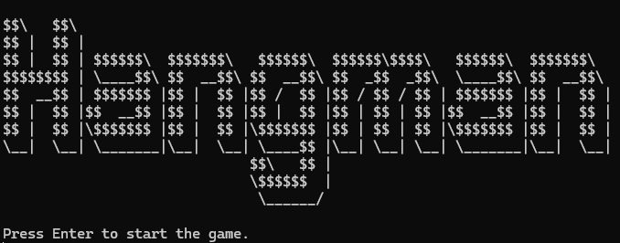

# hangman-py

A word-guessing game created using Python. Runs using the user's terminal.

## Setup Guide

1. Install `Python 3 or newer version`: [https://www.python.org/downloads/](https://www.python.org/downloads/)
2. Download/clone this repository using the command in your computer's terminal:

   ```
   git clone https://github.com/driee17/hangman-py.git
   ```

3. Run `python game.py` command using the terminal inside the game's folder.
4. This start screen should display in the terminal to indicate that the game can be played. Enjoy!

   

## Game Mechanics

This game is inspired by the original 'hangman' game, wherein the player will:

- Guess a Hidden Word – A secret word is chosen by the game (or another player in traditional play). The word is represented by blank spaces, with each space corresponding to a letter in the word.
- Make Letter Guesses – The player guesses letters one at a time, trying to identify the hidden word. The player can suggest any letter of the alphabet.
- Reveal Correct Letters – If the guessed letter is in the word, all instances of that letter are revealed in their respective positions.
- Track Incorrect Guesses – If the guessed letter is not in the word, it is considered incorrect, and a penalty is applied. In classic hangman, this penalty is represented by drawing parts of a hanging stick figure.
- Limit of Incorrect Guesses – The player has a limited number of incorrect guesses before the game is lost. Typically, a full stick figure (head, body, arms, and legs) indicates a loss.
- Win Condition – The player wins if they correctly identify all the letters of the word before reaching the maximum number of incorrect guesses.
- Lose Condition – The player loses if they reach the maximum number of incorrect guesses without completing the word.
- Game Over and Replay Option – At the end of the game, the final word is revealed, and the player may be given the option to play again.

A scoring system is also implemented which has 3 difficulties with the corresponding points:

- Easy - 1 point
- Medium - 3 points
- Hard - 5 points

A player will only be able to get the score if they correctly guess the secret word; else, they finish the game with their cuurrent score.

## Contents

- `game.py` - contains the main logic of the game
- `dictionary.py` - contains the list of words used in the game
- `highscore.py` - contains the current highscore
